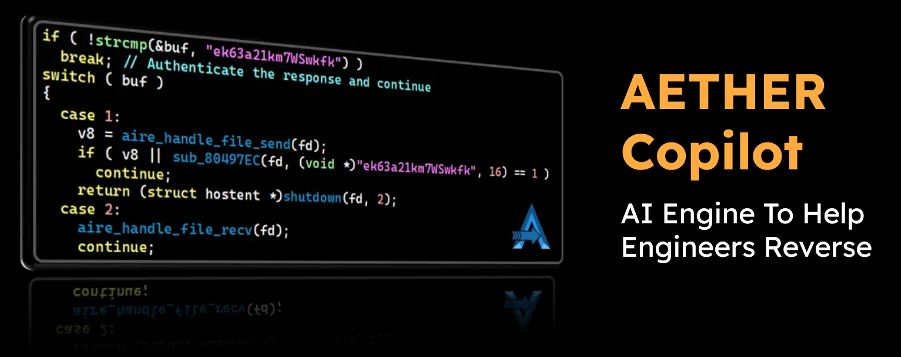
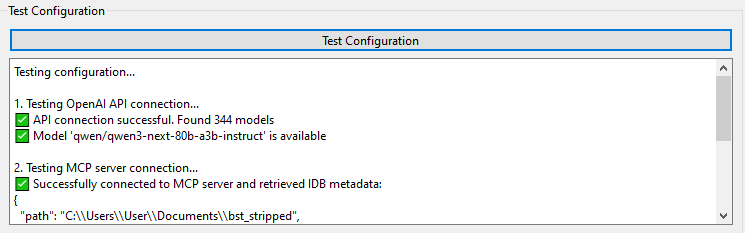
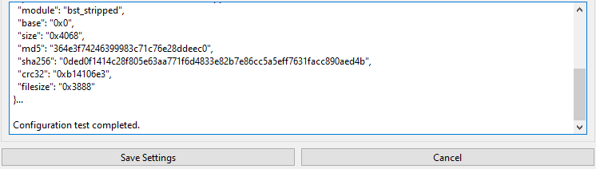

# AETHER - AI-Powered IDA Pro Reverse Engineering Plugin



<p align="center">
    <em>
    An AI-powered reverse-engineering copilot for assisting tedious malware analysis in IDA Pro.
    </em>
</p>


<p align="center">
  
  
  
  
</p>

---

## Table of Contents

- [Overview](#overview)
- [Key Features](#key-features)
- [Improvements over Raw IDA Pro MCP](#improvements-over-raw-ida-pro-mcp)
- [Requirements](#requirements)
- [Installation](#installation)
- [Manual Installation](#manual-installation)
- [How to Run](#how-to-run)
- [Usage Examples](#usage-examples)
- [Dependencies](#dependencies)
- [Documentation](#documentation)
- [Limitations](#limitations)
- [Authors/Maintainers](#authorsmaintainers)
- [License](#license)
- [Acknowledgments](#acknowledgments)
- [Sources](#sources)

---

## Overview

**AETHER** is an advanced IDA Pro plugin that integrates Large Language Models (LLMs) into your reverse engineering workflow. It automates time-consuming tasks like function annotation, variable renaming, structure creation and contextual analysis, allowing security analysts to focus on deeper malware analysis and threat assessment.

The plugin leverages the IDA Pro Model Context Protocol (MCP) to communicate with LLMs while efficiently managing context and tokens. It is specifically designed for malware analysis, vulnerability research, and binary reverse engineering.

---

## Key Features

### 1. **Intelligent Annotation System**
   - Automatically add meaningful comments to functions and code sections
   - Rename variables and function names to improve code readability
   - Support for fast annotation mode for quick analysis
   - Undo/Redo functionality for annotation changes

### 2. **Smart Function Context Gathering**
   - Selectively gather function call hierarchies for AI analysis
   - LLM intelligently selects which functions to analyze in context
   - Displays function call trees to understand code relationships

   Example call tree:
   ```
   start [0x10f0]
   └── main [0x1240]
       ├── sub_11E0 [0x11e0]
       └── sub_1F90 [0x1f90]
           ├── sub_1660 [0x1660]
           │   └── sub_1340 [0x1340]
           ├── sub_18F0 [0x18f0]
           └── sub_1C00 [0x1c00]
               └── sub_1BA0 [0x1ba0]
   ```

### 3. **Real-Time Analysis**
   - Fast analysis mode for quick function insights
   - Real-time annotation with LLM-generated corrections
   - Streaming analysis for immediate feedback

### 4. **Structural Analysis**
   - Automatic structure creation and identification
   - Structure annotation and field naming
   - Structure member analysis and documentation

### 5. **Customizable Analysis**
   - User-defined custom prompts for specific analysis needs
   - Multiple LLM model selection
   - Configuration management for different analysis profiles
   - Retry analysis with different parameters

### 6. **Batching & Automation**
   - Analyze multiple functions in batch mode
   - Automated context selection and gathering
   - Efficient token usage through context management

### 7. **Copilot - Interactive AI Assistant**
   - **Multi-turn Conversation**: Inquire LLM for clarifications and follow-up questions
   - **Context Management**: Select functions as context for intelligent analysis
   - **Code Summarization**: Get concise summaries of complex code sections
   - **Natural Language Queries**: Ask questions about function behavior and logic

---

## Improvements over Raw IDA Pro MCP

- **Context Management**: Intelligently manages LLM context window to maximize analysis quality
- **Optimized Prompting**: Specialized prompts engineered for reverse engineering tasks
- **Token Efficiency**: Reduces token consumption while maintaining analysis quality
- **One-Shot Tool Usage**: Minimizes API calls through efficient tool interaction
- **IDA Integration**: Seamless integration with IDA Pro UI and workflows
- **Undo/Redo Support**: Track and revert AI-generated changes
- **Multi-Model Support**: Works with multiple LLM providers and models

---

## Requirements

### Minimum System Requirements
- **Operating System**: Windows, Linux, or macOS
- **Python**: 3.11 or higher
- **IDA Pro**: Version 9.0 or above
  - Tested on IDA Pro 9.1 and 9.2

### API Requirements
- **LLM API Key**: An OpenRouter API Key is required by default.
    - Provider Flexibility: While pre-configured for OpenRouter, Aether supports any OpenAI-compatible API. 
    - You can customize the provider by editing the `DEFAULT_CONFIG` in your settings
- **Network**: Internet connection for LLM API calls (or local LLM server setup)

### Others
- **MCP Server**: `ida-pro-mcp` server version 1.5.0a8 (installed automatically during setup)

---

## Installation
### Automatic Installation of `ida-pro-mcp` & AETHER (Recommended)
There are currently 2 methods of installation, online & offline versions.

The key differences between the two is the the online version **downloads necessary dependencies** while the offline version **assumes ALL dependencies have been installed and checks for them**.

Run the following after going into the directory `/scripts`.

#### Windows

```powershell
# Using execution policy bypass (recommended)
powershell -executionpolicy bypass -file .\install.ps1

# OR if your execution policy is already set to Unrestricted
.\install.ps1

# For verbose output and troubleshooting
powershell -executionpolicy bypass -file .\install.ps1 -Verbose
```

#### Linux / Ubuntu

```bash
chmod +x install.sh
./install.sh

# For verbose output and troubleshooting
./install.sh -v
```

### Post-Installation Configuration

After running the installation script:

1. **Start the MCP Server** in a new terminal/console and run: ida-pro-mcp --transport http://127.0.0.1:8744/sse
2. **Open IDA Pro** and load any binary file 
3. **Open Pseudocode View** (Press `Tab`)
4. **Right-click** and select `AETHER AI-RE > Plugin settings`
5. **Enter your API credentials**:
   - API Key: **Your LLM provider API key (e.g., OpenAI API key)**
   - Base URL: The API endpoint (e.g., `https://api.openai.com/v1`)
   - Model: The model name (e.g., `gpt-4-turbo`, `gpt-3.5-turbo`)
6. **Click "Test Configuration"** to verify your setup. It should look like this:




7. **Save** your configuration
8. **Continue** using Aether plugin. See [How to Run](#how-to-run) section.

**NOTE** that only **1** instance of IDA may be running at a time.

---

## Manual Installation

For developers or advanced users who prefer manual setup:

1. Clone this repository:
   ```bash
   git clone https://github.com/CSIT-SG/AETHER
   cd AETHER
   ```

2. Install IDA Pro MCP (Local Wheel):
    Ensure the .whl file is located in your packages directory, then run:
   ```bash
   pip install ./scripts/packages/ida_pro_mcp-1.5.0a8-py3-none-any.whl
   ```

3. Install AETHER dependencies:
   ```bash
   pip install -r requirements.txt
   ```

4. Switch IDA Python environment (if needed):
   ```bash
   idapyswitch
   ```

5. Verify IDA Python and plugin environment match

---

## How to Run
### Use AETHER Features

In IDA Pro, navigate to the Pseudocode View (Tab key) and right-click to access AETHER features:

- **Fast Analysis**: Quickly annotate only the current function for rapid triage
- **Batch Analysis**: Analyze a function tree or manually selected function set, and annotate selected functions
- **Smart Select Analysis**: Let AI pick out more important functions to analyze that are related to current function for annotation
- **Struct Creator**: Infer and create a struct for the highlighted variable, then apply it in IDA
- **Report Generator**: Generate a report on the current function
- **AI Unflatten**: Deobfuscate flattened control flow and present cleaner pseudocode for review
- **Indexing Binary**: Build a searchable function index with categories and importance levels for faster context retrieval
- **Chatbot**: Use natural-language queries with tool-assisted lookups and indexed context for interactive analysis (for index, index binary before running chatbot for best effect)
- **Python Script Generation**: Chatbot can call upon tool `generate_python_script` to create scripts for deobfuscation or other purposes
- **Settings**: Configure API keys and analysis parameters

---

## Usage Examples

### Auto-Annotating a Function

1. Right-click on a function in Pseudocode View
2. Select `AETHER AI-RE > Annotate only this Function`
3. AETHER will:
   - Analyze the function logic
   - Generate meaningful variable names
   - Add explanatory comments
   - Apply changes to IDA Pro
4. Use `Undo latest annotation` if you want to revert changes

### Batch Analyzing a Call Chain

1. Right-click on a function in Pseudocode View
2. Use `AETHER AI-RE > Annotate function tree with default selection` to build call tree
3. Select functions within the call tree that should be excluded/included
4. AETHER processes the entire call chain with intelligent context management

### Indexing a Binary and Reviewing Results

1. Right-click in Pseudocode View and open `AETHER AI-RE > Indexing > Index Binary`
2. Wait for indexing to complete. A completion popup will show how many functions were classified.
3. Open `AETHER AI-RE > Indexing > Index Statistics` to review:
   - Total indexed functions
   - Batch progress and token usage
   - Importance/category breakdown
   - The exact `Index file:` path at the bottom of the statistics dialog
4. To find the index file on disk:
   - Copy the path shown in `Index Statistics` and open it with your file manager/editor, or
   - Go to the default index directory:
     - Windows: `%LOCALAPPDATA%\\AETHER-IDA\\indexes\\`
     - Linux/macOS: `~/.idapro/ainalyse-indexes/`
   - The file is stored as `<program_identifier>.json`.
5. If the binary changes significantly or tags look outdated, run `AETHER AI-RE > Indexing > Re-index Binary`.
   - This clears the previous index and rebuilds it from scratch.
6. If indexing is interrupted, use `Resume Indexing` to continue from saved progress.

### Custom Prompt Analysis

1. Right-click on a function in Pseudocode View
2. Select `AETHER AI-RE > AInalyse (advanced options)`
3. Enter your custom prompt (e.g., "Find all potential vulnerabilities in this code")
4. AETHER analyzes the function using your custom instructions

### Automatic Structure Creation

1. In IDA Pro's Pseudocode View, click on a variable and highlight it
2. Right-click and select `AETHER AI-RE > Create struct for highlighted variable` (or press `Ctrl+Alt+V`)
3. AETHER will:
   - Analyze the variable and its usage patterns across the function
   - Identify structure members and their offsets
   - Determine field types based on code context
   - Create a properly formatted C structure definition
   - Automatically apply the struct type to the variable in IDA Pro
4. Review and refine the created structure in IDA's struct view if needed

**Limitations:**
- Works best with variables that have clear access patterns (e.g., `var->member` or `var[offset]`)
- Requires sufficient context within the function to infer member types accurately
- May struggle with complex nested structures or opaque variable usage
- Manual review recommended for critical reverse engineering tasks

### Interactive AI Copilot

1. Right-click in Pseudocode View and select `AETHER AI-RE > Open AI Chatbot`
2. A dedicated Chatbot panel opens with conversation interface
3. **Ask Questions** - Type natural language questions about the code:
   - "What does this function do?"
   - "Which functions call this one?"
   - "What are potential security issues here?"
4. **Add Context** - Click `Add Context` button (paperclip icon on Windows, gear icon on linux) to select functions:
   - Opens a function picker dialog
   - Select up to 50 functions to provide context
   - Context is used by LLM for more informed answers
5. **Use Available Tools** - The LLM can automatically:
   - List functions with `list_functions`
   - Get pseudocode with `get_function_pseudocode`
   - Retrieve data at addresses with `get_data_at_address`
   - Find cross-references with `get_xrefs_to`
6. **Manage Conversation** - Create action plans and tasks:
   - LLM creates action plans for complex analysis
   - Track tasks as "Not Started", "In Progress", "Completed", or "Failed"
   - Maintain conversation history and short-term memory
7. **Save Results** - Export conversation and findings:
   - Save summaries to local files
   - Export analysis for documentation
   - Build knowledge base from previous sessions

**Available Chatbot Right-Click Options:**
   - **Find (Ctrl+F)** - Find string within AI output
   - **Clear chat history**
   - **Manually Select Available Functions** - Limit tools AI may use (may prevent AI from working as intended)
   - **Stop prompt** - Stops the conversation midway

**Limitations:**
- **Context Window** - Limited to 50 functions max to prevent LLM context overflow
- **Conversation History** - Older conversations may be summarized to maintain token efficiency (default: 10 message limit before summarization)
- **LLM Accuracy** - Answers depend on LLM quality and model choice
- **Real-time Constraints** - Complex analysis may require longer processing time
- **Thread Safety** - Some IDA API calls may cause delays during function listing or pseudocode retrieval
- **Dependency on Function Names** - Analysis quality improves with well-named functions and variables
- **Further Development** - Currently no interaction with ida-pro-mcp, unable to edit pseudocode view.

**Settings and Others**:
- **Configuration**: `config.json` will be created with default configurations. This is also editable from within IDA via AETHER.
  - Windows: `C:\Users\<username>\AppData\Local\AETHER-IDA\config.json`
  - Linux: `~/.idapro/plugins/ainalyse-config.json`
---

## Dependencies

### Python Packages

```
mcp                  # Model Context Protocol client
openai               # OpenAI API client
psutil               # System utilities
pydantic>=2.11.7     # Data validation
python-dotenv>=1.1.1 # Environment variable management
```

### External Tools

- **ida-pro-mcp**: MCP server for IDA Pro integration
- **IDA Pro Python SDK**: Automatically available in IDA Pro 9.0+

### Optional Dependencies

- **OpenAI API**: For using various OpenRouter provided models.
- **Custom LLM Servers**: For local LLM deployments (Ollama, vLLM, etc.)

---

### Verbose Logging

For detailed troubleshooting, enable verbose mode:

**Windows:**
```powershell
powershell -executionpolicy bypass -file .\install.ps1 -Verbose
```

**Linux:**
```bash
./install.sh -v
```

---

## Documentation

For more detailed information:
- See [docs/](./docs/) folder for additional documentation
- Check [docs/BUGS.md](./docs/BUGS.md) for known issues and bug reports
- View [docs/FAQ.md](./docs/FAQ.md) for common issues and fixes
- Refer to inline code comments for implementation details

---

## Limitations
- LLM's accuracy is variable
- Comments are generally less trustable than function and var names - working on it
- Occasional formatting issues now and then
- Retry actions several times for varying results if current results are unsatisfactory

---

## Authors/Maintainers 

This project is authored by:
- Ang Guang Yao ([@guangyaoa123](https://github.com/guangyaoa123))
- Ang Ian ([@Ang-Ian](https://github.com/Ang-Ian))
- Chan Weng Tim ([@TimTimTimTimTimTimTimTimTimTimTimTimTi](https://github.com/TimTimTimTimTimTimTimTimTimTimTimTimTi))
- Kan Onn Kit ([@PhotonicGluon](https://github.com/PhotonicGluon))
- Leland Tan Jin Jie ([@loland](https://github.com/loland))
- Mervyn Chua ([@MervC-3151](https://github.com/MervC-3151))
- Ng Jun Han ([@GoldenStone02](https://github.com/GoldenStone02))
- Tan Yehan ([@XxHanpowerxX](https://github.com/XxHanpowerxX))
- Theodore Lee Chong Jen ([@TheoLeeCJ](https://github.com/TheoLeeCJ))
- Zeph Teo ([@fritzthecrisp](https://github.com/fritzthecrisp))

---

## License

This project is licensed under the terms of the GPLv3 license. It can be found at [LICENSE](./LICENSE).

---

## Acknowledgments

This project was created and/or upgraded thanks to the following organizations and initiatives:

<body>
<h3>Centre for Strategic Infocomm Technologies</h3>

<a href="https://www.csit.gov.sg/">
    
</a>
<h3>The Digital and Intelligence Service</h3>

<a href="https://www.dis.gov.sg/">
    
</a>

AETHER is made possible through the dedication of Cyber Specialists under the Digital and Intelligence Service’s (DIS) Defence Cyber Command (DCCOM).

</body>

---

## Sources
- IDA Pro MCP - https://github.com/mrexodia/ida-pro-mcp/tree/main
- Plugin optimised for [`Qwen: Qwen3 Next 80B A3B Instruct`](https://openrouter.ai/qwen/qwen3-next-80b-a3b-instruct)
- Thanks to all who provided feedback and annotated IDA files

---

**Last Updated**: 10/04/2026

**Version**: 2026.2