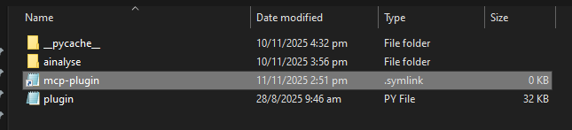
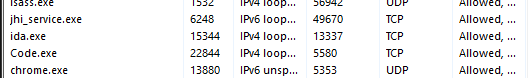
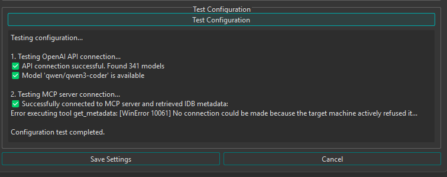

## Known Bugs
> Update this section as the project goes along.

1. Possible Symlink Error with `ida-pro-mcp` on IDA Pro 9.2 - it crashes due to a symlink created within `%APPDATA%\Hex-Rays\IDA Pro\plugins` folder. This could cause an unintended issue where IDA Pro crashes on bootup. The ideal fix would be to **use IDA Pro 9.1** instead of version 9.2

2. Server running on port 13337 does not get spun up if 2 IDA instances are on. I.e. the web server running on port 13337 is binded to the 1st `ida.exe` process, so killing that would result in the 2nd `ida.exe` instance not being able to access said web server.

3. An issue (related to `Bug 2` but not directly) that passes a configuration precheck which is supposed to fail. This happens if `localhost:13337` is already binded, which causes `ida-pro-mcp` to fail its startup. 

