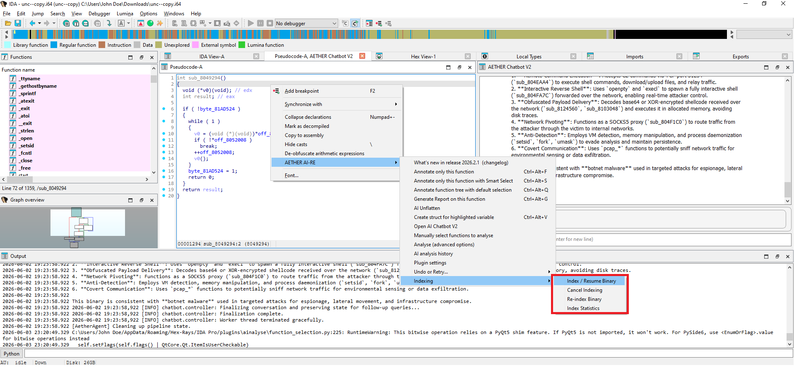
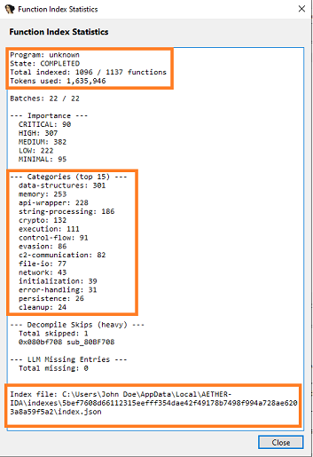
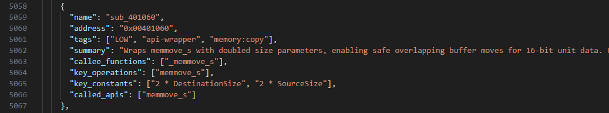
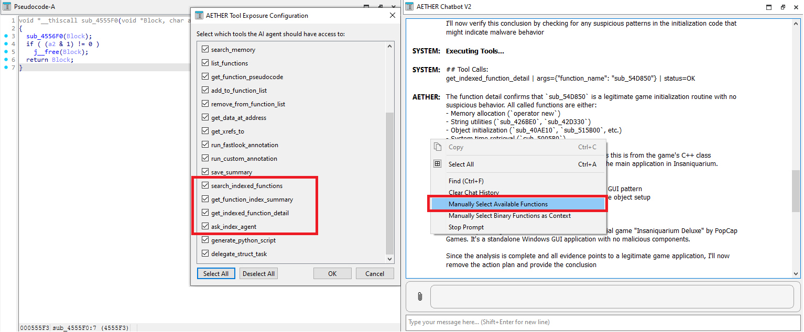
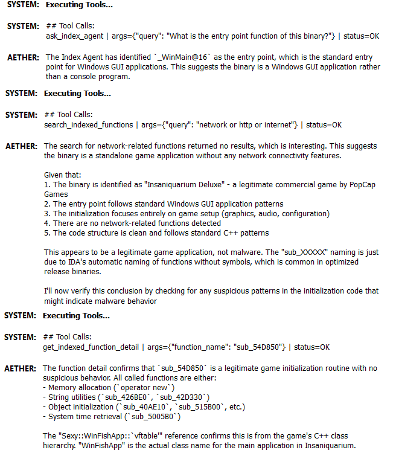

# Function Indexing: Comprehensive Overview

## TL;DR

**Indexing is one-time binary analysis that classifies every function as CRITICAL/HIGH/MEDIUM/LOW, assigns functional categories (crypto, network, persistence, etc.), and generates summaries.** 



1. `Index / Resume Binary` to trigger the indexing process
2. `Cancel Indexing` if you want to pause indexing (ONLY pauses when a batch has completed, there is no force cancel.)
3. `Re-index Binary` if you want to erase the entire index and start from scratch again.
4. `Index Statistics` gives you an overview of the indexing process. When indexing is completed, 



Indexing may take between 10 minutes and a few hours depending on the size of the binary/size of pseudocode. 

But once it is done, you can ask the chatbot contextless questions, and it will query a sub-agent tool to determine the answer. 

Each function entry will have the following information that will be queriable by the sub-agent tool(ask_index_agent):  

    
      "name": "sub_401BF0",
      "address": "0x00401BF0",
      
      "tags": ["HIGH", "data-structures:locale-facet", "initialization", "string-processing:ctype-setup"], <ranking out of 5, list of short descriptions>
      
      "summary": "Initializes a std::ctype<char> facet using the \"C\" locale, populates it with ctype data from _Getctype, and manages memory for character tables. Critical for enabling character classification (isalpha, tolower) in locale-aware text processing — core component of C++ iostream and string handling.", <long description>
      
      "key_operations": ["_Getctype", "sub_401350", "sub_4014F0", "free"], <what does this function do simplified>
      
      "key_constants": [
        "\"C\"",
        "8",
        "20"], <list of any number on strings identified>

      "called_apis": ["sub_401350", "sub_4014F0", "_Getctype", "free", "j_j__free"] <functions that were called>
    

Before you can use the capabilities of the index via the chatbot, make sure you enable the tools that are disabled by default. 

Once done, you can:
- Ask the chatbot "What functions handle encryption?" and get instant results.
- Search by importance to find entry points and high-value targets.
- Preserve the analysis across IDA sessions.
- **Re-index at any time**: After making manual annotations or code changes, re-run indexing to reclassify the entire binary with the latest pseudocode and produce a more accurate index.

**When to use it:**
- Large binaries (>2,000 functions): Replace tedious manual review with queryable index.
- Malware analysis: Instantly identify persistence, C2, evasion, and crypto routines.
- Firmware/library analysis: Map functionality without reading all code.

**When to skip it:**
- Small binaries (<200 functions): Manual review is faster.
- Time-critical incidents: Use annotator/chatbot directly; indexing takes 5-75 minutes depending on binary size.

---

## What is Indexing?

Indexing is an **asynchronous LLM-powered classification system** that semantically analyzes every function in a binary. It requires a connection to an LLM API endpoint and runs once per binary, producing a persistent JSON index containing:

- **Importance levels** (CRITICAL, HIGH, MEDIUM, LOW, MINIMAL) for each function
- **Functional categories** (network, crypto, file-io, persistence, evasion, etc.)
- **Key operations** (XOR, socket, fopen, RegSetValue, etc.)
- **Key constants** (magic bytes, hardcoded IPs, buffer sizes)
- **Called APIs** (external dependencies like CreateFileA, send, malloc)
- **Summaries** (2-3 sentence descriptions of function purpose)
- **Call graph context** (which functions each function calls)

Once indexed, the data is used by:
- **Chatbot Index Agent**: Semantic keyword search over function metadata to answer natural-language questions. Queries the index to find functions matching semantic queries (e.g., "What functions handle encryption?")
---

## Scenarios: When to Index and When NOT to

### ✅ **Index This**

**Large malware samples (>2,000 functions)**
- **why**: Manual annotation is infeasible. Indexing gives a comprehensive map of functionality.
- **Expected time**: 20-75 minutes depending on function count and hardware.
- **Value**: Can immediately identify suspicious functions (persistence, evasion, C2) without reading all code.

**Firmware analysis (complex embedded systems)**
- **why**: Firmware often contains hundreds of init functions, driver code, and proprietary logic. Indexing separates signal from noise.
- **Expected time**: 15-45 minutes depending on function count.
- **Value**: Quickly identify memory management, interrupt handling, and protocol parsing zones.

**Closed-source library analysis**
- **why**: You have no source; indexing provides a functional map of the library's capabilities.
- **Expected time**: 10-30 minutes depending on library size.
- **Value**: Understand the library's architecture without decompiling every function manually.

**Threat intelligence: Malware family analysis**
- **why**: If analyzing multiple samples from the same family, index the first one to identify functional patterns, then look for those patterns in subsequent samples.
- **Expected time**: 20-75 minutes depending on sample size and complexity.
- **Value**: Rapidly fingerprint samples for attribution and behavior clustering.

---

### ❌ **Don't Index This**

**Small binaries (<200 functions)**
- **why**: Manual analysis is faster. You can read the function list and run annotator on a few key functions.
- **Cost/benefit ratio**: Indexing overhead (decompilation, LLM calls) exceeds the value of the resulting index.

**Toy/academic examples**
- **why**: The binary's intent is already obvious (hello_world, simple sorter, etc.).
- **Cost**: Wasted tokens and time.

**Time-critical analysis (active incident response)**
- **why**: Indexing takes 5-75 minutes depending on binary size. If you need answers **now**, skip indexing; use the chatbot/annotator directly on suspected functions.
- **Better approach**: Run the annotator on high-value functions while indexing runs in the background.

**Binaries with very slow decompilation**
- **why**: If most functions take >5 seconds to decompile, the total indexing time may exceed several hours.
- **Symptom**: Watchdog logs show many functions with elapsed_s > 30.
- **Better approach**: Index a subset by filtering in Phase 1 (reduce batch size, increase size thresholds).

---

## Pros and Cons

| Aspect | Pros | Cons |
|--------|------|------|
| **Coverage** | Classifies every function systematically (vs. manual selection bias). | May index unimportant functions unnecessarily; cannot skip certain classes without rebuilding. |
| **Speed (Search)** | Once indexed, searching by category is instant (vs. reading all function names). | Index build time varies with binary size (5-75 minutes). |
| **Consistency** | LLM applies the same taxonomy to all functions (vs. inconsistent human tagging). | LLM may misclassify obfuscated or domain-specific functions. |
| **Resumability** | Interrupted runs can resume (vs. starting over). | State tracking adds complexity; very rare edge cases may require manual index reset. |
| **Dynamic Tags** | Captures novel, binary-specific categories (e.g., `network:proprietary-protocol`). | Too many dynamic tags may indicate over-fitting; requires user review. |
| **Context Grounding** | Summaries, callees, and key ops provide evidence for classifications. | Summary quality depends on pseudocode quality (garbage decompile = garbage summary). |

---

## Ask Index Agent: Query Response Structure

When you ask the chatbot a question using the indexed data (via the `ask_index_agent` tool), the response comes as a **briefing packet** organized into three confidence tiers:

```
# Index Agent Briefing Packet

## Tier 1: Primary Candidates

- **0x401234** (`encrypt_payload`): Direct match for core encryption logic. Shows strong indication of AES-256 implementation with key derivation.
  Summary: Initializes encryption context and applies AES-256-CBC to payload data.
  Tags: crypto:aes-256, crypto:encryption
  APIs: CryptEncrypt, memset, malloc
  Callees: derive_key, apply_padding, xor_state

- **0x405678** (`handle_network_send`): Primary transport mechanism for encrypted data.
  Summary: Sends encrypted payloads over TCP socket to hardcoded C2 address.
  Tags: network:tcp, network:c2-communication
  APIs: socket, send, connect

## Tier 2: Secondary Candidates

- **0x409abc** (`apply_padding`): Supports padding logic for encryption.
  Summary: PKCS7 padding implementation used by primary encrypt_payload.
  Tags: crypto:operations
  APIs: memcpy

- **0x40def0** (`derive_key`): Key management for encryption.
  Summary: Derives encryption key from entropy pool and configuration bytes.
  Tags: crypto:key-generation

## Tier 3: Alternative Hypotheses

- **Hypothesis**: If the primary candidates turn out to be legitimate TLS/Windows API wrappers, you should pivot to these alternatives because they implement lower-level encryption logic.
  Pivot targets: 0x408888 (`custom_cipher_block`), 0x409999 (`xor_transform`)

- **Hypothesis**: If network communication uses unnamed pipes instead of TCP sockets, check these functions for inter-process communication.
  Pivot targets: 0x40aaa0 (`pipe_open`), 0x40bbb1 (`pipe_write`)
```

**Tier Structure:**
- **Tier 1: Primary Candidates** (1-5 functions) - Direct, high-confidence matches to your query
- **Tier 2: Secondary Candidates** - Supporting or peripheral functions that work alongside primary candidates
- **Tier 3: Alternative Hypotheses** - Escape hatches if primary candidates are dead code, false positives, or misleading. Includes reasoning for why to pivot and target addresses to investigate.

---

## Required Tools & Configuration

### Minimum Requirements
- **IDA Pro** + **Hex-Rays decompiler**: Indexing will not run without Hex-Rays.
- **Any OpenAI-compatible LLM API**:
  - OpenAI (gpt-4, gpt-4-turbo, gpt-3.5-turbo)
  - Local LLM via Ollama, vLLM, or LocalAI
  - Azure OpenAI
  - Custom enterprise LLM endpoint
- **Network access** to the LLM API.

### Configuration (`config.json` or `ainalyse.config`)
```json
{
  "OPENAI_API_KEY": "sk-...",
  "OPENAI_BASE_URL": "https://api.openai.com/v1",
  "OPENAI_MODEL": "gpt-4-turbo",
  "indexing_model": "gpt-3.5-turbo",
  "indexing_batch_size": 50,
  "indexing_decomp_chunk_size": 20,
  "indexing_max_func_size_bytes": 24576,
  "indexing_decomp_max_func_size_bytes": 12288,
  "indexing_decomp_heartbeat_interval_s": 5.0,
  "indexing_stuck_function_threshold_s": 45,
  "indexing_slow_decomp_threshold_s": 5,
  "indexing_max_tokens": 65536,
  "indexing_pseudocode_cache_enabled": true,
  "indexing_pseudocode_cache_max_chars_per_func": 0,
  "indexing_pseudocode_cache_max_total_chars": 0
}
```

### Storage
- **Index file**: Stored under `%LOCALAPPDATA%\AETHER-IDA\indexes\{SHA256}\index.json` (Windows) or `.ainalyse/indexes/{SHA256}/index.json` (others).
- **LLM batch logs**: Stored in `%LOCALAPPDATA%\AETHER-IDA\indexes\{SHA256}\llm_logs\` with one file per batch, including raw tool-call payloads (and message text if present).
- **Pseudocode cache**: Stored inside the index JSON as a compressed `pseudocode_cache` map (address -> compressed text).
- **Resumption**: Cached pseudocode is reused on resume to avoid re-decompiling unchanged functions.
- **Re-indexing**: You can re-index the same binary at any time to reclassify functions with the latest pseudocode. This is useful after making final annotations, code changes, or applying structures—the updated analysis will incorporate all your latest edits.
- **Legacy migration**: Older flat index files at `...\indexes\{SHA256}.json` are automatically migrated into the per-binary folder on first access.

---

# Appendix: Additional Technical Details

## How Indexing Works: The Five Phases

### Phase 1: Function Collection & Filtering
The indexer enumerates **all functions in the IDB**, then **aggressively filters out boilerplate**:
- **Library functions** (marked with `FUNC_LIB` flag)
- **Import stubs** (`__imp_*` functions)
- **Thunks & jump stubs** (e.g., `j_func`, `thunk_*`)
- **Compiler-generated wrappers** (e.g., functions starting with `__` or `___`)
- **Common libc functions** (memcpy, strlen, malloc, printf, etc.)
- **Nullsub stubs** and empty functions < 16 bytes
- **Functions in .plt/.extern/.import segments**
- **Functions exceeding a size threshold** (default: 24 KB, decompile target: 12 KB)

**Result**: A curated list of "interesting" functions likely to have analytical value.

---

### Phase 2: Decompilation (Hex-Rays Pseudocode Generation)
The indexer **generates pseudocode for every collected function** using Hex-Rays. This is the most time-consuming phase because:
- Decompilation must run on IDA's **main thread** (not thread-safe).
- Each function is decompiled **one-by-one** with UI progress updates.
- Functions that take >5 seconds are logged; stuck functions (>45s) trigger watchdog warnings.

**Cache**: Pseudocode is cached in the index JSON (compressed) so interrupted runs can resume without re-decompiling.

---

### Phase 3: LLM Classification (Batched Prompt Engineering)
Once pseudocode is ready, the indexer:
1. Builds batches of functions (default: 50 per batch).
2. Constructs detailed classification prompts with importance levels, category taxonomy, output format specs.
3. Sends prompts to the LLM (OpenAI-compatible API).
4. Requires tool calls and parses tool-call payloads into index entries.
5. Resolves tags: exact matches, fuzzy matching, dynamic tag registration for novel categories.
6. Deduplicates redundant tags.

**Token Budget**: Prompts capped at ~350K characters (~87.5K tokens) to leave room for responses.

---

### Phase 4: Unknown Resolution (Second-Pass Classification)
Functions marked only as "unknown" are re-classified in a lighter second pass:
1. Collect all entries whose only non-importance tag is `unknown`.
2. Build a lighter prompt with key operations, called APIs, callees, and summaries.
3. Ask the LLM to reclassify using tool calls and configured categories (or invent new ones).
4. Replace `unknown` tags with resolved categories.

**Purpose**: Catch first-pass over-conservatism without hallucinating new APIs.

---

### Phase 5: Persistence & Resumption
The indexer persists state at multiple granularities:
- **Decompile watchdog** (every ~5 seconds): Saves function-level decompile progress.
- **Batch completion**: After each successful LLM batch, entries are written to the index.
- **Resumption**: On next launch, loads partial index, skips already-indexed functions, resumes decompilation and LLM batches.
- **Cancellation**: Users can cancel at any time; progress is saved.

---

## Technologies & Infrastructure

### Hex-Rays Decompiler
- **Role**: Generates human-readable pseudocode from binary code.
- **Why**: LLMs work much better with pseudocode than raw disassembly.
- **Requirement**: Must be available or indexing aborts.

### LLM (OpenAI-Compatible API)
- **Role**: Semantic classification, summary generation, unknown resolution.
- **Configuration**: Supports custom endpoints, mTLS, intranet headers.
- **Why indexing needs an LLM**: Only an LLM can perform semantic reasoning ("is this C2 handling?"). Rule-based heuristics miss domain-specific patterns.

### Batching & Token Accounting
- **Batch size**: Configurable (default 50 functions).
- **Token counting**: Each API call tracked; tokens summed for final report.
- **Unknown batches**: Smaller batch size (40) for faster requests.

### Dynamic Tag Manager
- **Role**: Registry for novel tags invented by the LLM.
- **Persistence**: All dynamic tags stored in index JSON with usage count and example functions.
- **Purpose**: Allows downstream consumers to see full vocabulary and understand novel categories.

### Watchdog Threading
- **Decompile watchdog**: Separate thread periodically persists staging state.
- **Stuck detection**: Logs functions decompiling for >45 seconds.
- **Non-blocking**: Does not pause decompilation, just monitors and logs.

---

## Safety: Preventing Hallucination and Tunnel Vision

### How the Design Guards Against LLM Hallucination

**1. Structured Input (Pseudocode + Context)**
- The LLM sees actual pseudocode, not just function names.
- Pseudocode paired with called APIs, key operations, and callees.
- Prevents LLM from inventing APIs the function doesn't call.

**2. Two-Pass Classification**
- First pass: LLM classifies with full pseudocode and context.
- Second pass: For functions tagged only as "unknown", re-classify using existing metadata.
- Catches first-pass over-conservatism without hallucinating new APIs.

**3. Category Taxonomy Constraint**
- Explicit list of 24+ configured categories; forbids inventing new parent categories.
- Dynamic categories must use parent:child notation (e.g., `network:icmp`).
- Prevents nonsense categories.

**4. Tag Normalization & Deduplication**
- All tags normalized to kebab-case.
- Redundant tags dropped (e.g., keep only `crypto:aes-256` if both `crypto` and `crypto:aes-256` exist).
- Unknown dropped if any real category exists.

**5. Token Accounting & Inspection**
- All LLM calls logged with token counts.
- Index JSON persists all classifications for user audit.
- Total tokens reported to check for excessive querying.

**6. Resumable, Cancellable Indexing**
- Users can stop at any time and inspect partial results.
- Can re-run if unhappy (without re-decompiling).
- No "run-to-completion trap".

### Preventing Tunnel Vision

**1. Importance Levels Force Broad Analysis**
- Importance classified separately from functional categories.
- CRITICAL marking forces consideration of entry point status.

**2. Multiple Functional Categories (1-3 per function)**
- Encourages diverse categorization.
- Prevents single-category tunnel vision.

**3. Callees & Call Graph Context**
- Index reports function call relationships.
- Helps avoid treating leaf functions as high-level routers.

**4. Key Operations & Summaries**
- LLM must list observable operations (XOR, send, malloc) and write summary.
- Summaries force justification in natural language.
- Hallucinated classifications would have mismatched summaries.

---

## How the Master Agent Uses the Index

The **Chatbot's Index Agent** (`ask_index_agent` tool) uses the index to answer questions:

### Query Flow
1. **User asks**: "What functions encrypt data?"
2. **Index Agent searches** for functions with `crypto:*` tags or "encrypt" in summaries.
3. **Reranks by importance** (CRITICAL functions first).
4. **Generates natural-language summary** of findings with function names, addresses, key ops.
5. **Chatbot displays** results with suggested next steps.

### Why This Matters for Malware Analysis
Users need to quickly identify **all encryption routines**, **persistence mechanisms**, and **command handlers** without reading thousands of function names. The index enables instant, high-confidence discovery ranked by importance. This accelerates analysis by orders of magnitude.

---

## Summary

**Indexing is a batch semantic analysis system** that transforms manual, error-prone function review into a queryable database. It leverages:
- **Hex-Rays pseudocode** for accurate code understanding.
- **LLM reasoning** for semantic classification.
- **Structured prompting** to constrain hallucination.
- **Two-pass unknown resolution** to catch misclassifications.
- **Persistent caching** to enable resumption and quick re-analysis.

**For malware analysts**, it enables rapid functional mapping of large binaries, dramatically reducing the time from "unknown sample" to "understood threats and artifacts."

**For Ghidra users**, implementing indexing means leveraging Ghidra's decompiler API and connecting to the same MCP-served LLM infrastructure, preserving the exact same feature set and user experience.
